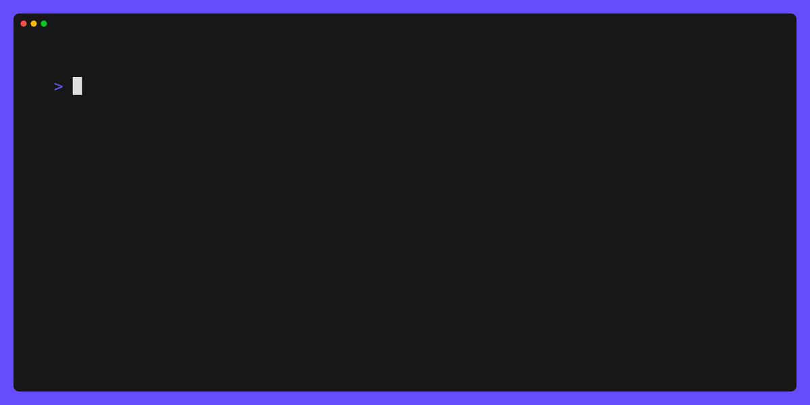
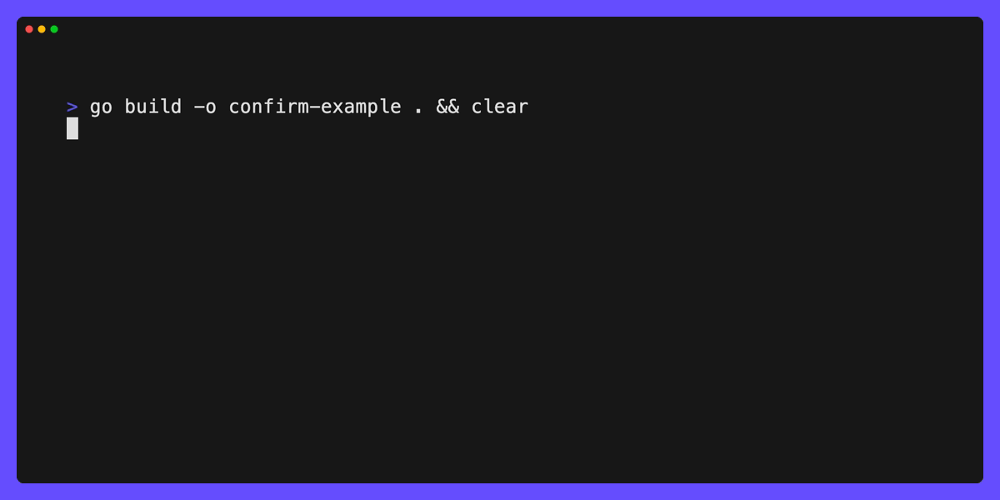

# answer

Have your user answer some questions in terminal.

This project intends to provide functionality similar to [github.com/AlecAivazis/survey](https://github.com/AlecAivazis/survey), but built on top of [bubbletea](https://github.com/charmbracelet/bubbletea).


[](./LICENSE)  
[](https://github.com/jimschubert/answer/actions/workflows/build.yml)
[](https://goreportcard.com/report/github.com/jimschubert/answer)

## Bubbles

This library provides the following bubbles:

* `input`: single-line textual input with validations
* `selection`: multi-selection with optional single-select
* `confirm`: a yes/no/undecided with multiple visual representations (input, horizontal/vertical selection)

### input

The `input` bubble provides a minimal wrapper around `github.com/charmbracelet/bubbles/textinput`. You get all the implementation
of the upstream textinput bubble, with a little extra "flair" (a prompt prefix character, plus validations). This allows for styling
more closely to what you might have had with [github.com/AlecAivazis/survey](https://github.com/AlecAivazis/survey).

See [internal/examples/input](internal/examples/input):



### selection

The `selection` bubble provides a paginated list of items from which the user can select 0 or more items. This bubble defaults
to multi-select, but can be made single-select by setting `MaxSelections` to 1. Styles, as well as indicators for prompt,
chooser, and selection are customizable.

See [internal/examples/selection](internal/examples/selection):


### confirm

The `confirm` bubble provides a yes/no/undecided type of input. This is configurable to show the common terminal usability such as:

> ? Do you want to continue? y/N

Where the default value is indicated by an uppercase character. In this default rendering display, the user is able to 
type either `y` or `n` (case insensitive) or hit enter to proceed with the default.

The confirm bubble also supports horizontal and vertical list-style selections.

Horizontal selection could be presented like:

> ? Prompt? ➤Yes  No

Vertical selection could be presented like:

> ? Prompt?
> ➤ Yes
>   No

See [internal/examples/confirm](internal/examples/confirm):



## Install

```
go get -u github.com/jimschubert/answer
```

## Build/Test

```shell
go test -v -race -cover ./...
```

## License

This project is [licensed](./LICENSE) under Apache 2.0.
