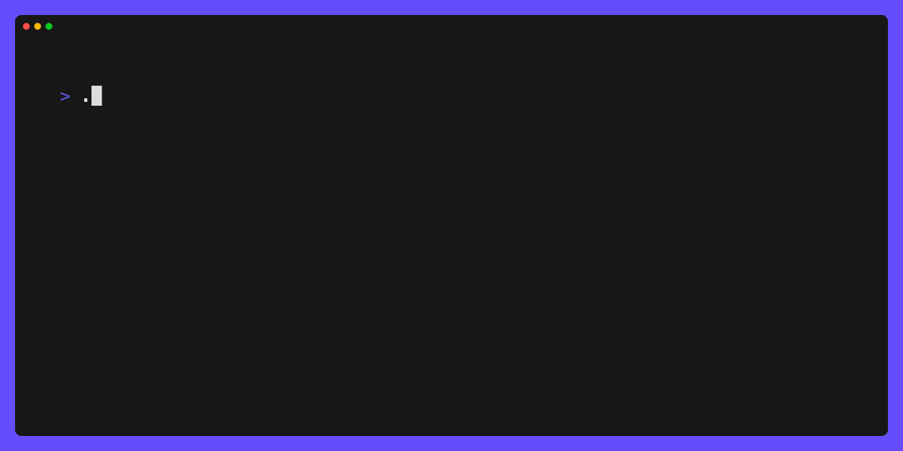

# answer

Have your user answer some questions in terminal.

This project intends to provide functionality similar to [github.com/AlecAivazis/survey](https://github.com/AlecAivazis/survey), but built on top of [bubbletea](https://github.com/charmbracelet/bubbletea).


[](./LICENSE)  
[](https://github.com/jimschubert/answer/actions/workflows/build.yml)
[](https://goreportcard.com/report/github.com/jimschubert/answer)

## Bubbles

This library provides the following bubbles:

* `input`: single-line textual input with validations
* `selection`: multi-selection with optional single-select
* `confirm`: a yes/no/undecided with multiple visual representations (input, horizontal/vertical selection)

### input

The `input` bubble provides a minimal wrapper around `github.com/charmbracelet/bubbles/textinput`. You get all the implementation
of the upstream textinput bubble, with a little extra "flair" (a prompt prefix character, validations, suggestions). This allows for styling and functionality
more closely to what you might have had with [github.com/AlecAivazis/survey](https://github.com/AlecAivazis/survey).

See [internal/examples/input](internal/examples/input):


#### Validations

Simple validation functions are supported:

```go
m := input.New()
m.Prompt = "Please enter your name:"
m.Placeholder = "(first name only)"
m.Validate = func(v string) error {
    if v != "" && !unicode.IsUpper(rune(v[0])) {
        return errors.New("name must be uppercase")
    }
    return nil
}
p := tea.NewProgram(&m)
```

Complex validations defined in the `validate` package are also supported. These functions chain together via `validate.Func`, and provide
a common variadic argument for custom error messages (similar to testify's assert functions).

Validation functions available include:

* **MinLength**: defines the minimum rune count
* **MaxLength**: defines the maximum rune count
* **Matches**: defines a regex pattern to match
* **Contains**: a wrapper around strings.Contains
* **And**: pass a custom function to the validation chain, in which the chain and function are all evaluated (like `&&`)
* **Or**: pass a custom function to the validation chain, in which the custom function is only evaluated if the preceding validation passes (like `||`)

For example:

```go
m := input.New()
m.Prompt = "Please enter your name:"
m.Placeholder = "(first name only)"
m.Validate = validate.NewValidation().
    MinLength(2, "min: 2 characters").
    MaxLength(5, "max: 8 characters").
    And(func(input string) error {
        for _, r := range input {
            if !unicode.IsLetter(r) {
                return errors.New("letters only")
            }
        }
        return nil
    }).
    And(requireUppercase).
    Build()
p := tea.NewProgram(&m)
```



#### Suggestions

Suggestions can be applied via a set of static data using one of the provided text suggestion functions, or via a custom function allowing retrieval from any location such as an external datasource.

Provided suggestions include `suggest.LevenshteinDistance` and `suggest.StartsWith`, each with customizable options to optimize their behaviors.

To use `suggest.LevenshteinDistance` you can apply in the follow manner:

```go
	m := input.New()
	m.Prompt = "Please enter your name:"
	m.Placeholder = "(first name only)"
	m.Suggest = suggest.LevenshteinDistance([]string{"Jim", "James", "Jameson"},
		suggest.LevenshteinDistanceMin(0),
		suggest.LevenshteinDistanceMax(4))
```

To use a custom function, match the signature `func(value string) []string`. For example:

```go
	m := input.New()
	m.Prompt = "Please enter your name:"
	m.Placeholder = "(first name only)"
	m.Suggest = func(value string) []string {
		return []string{"A","B","C","D"}
	}
```

### selection

The `selection` bubble provides a paginated list of items from which the user can select 0 or more items. This bubble defaults
to multi-select, but can be made single-select by setting `MaxSelections` to 1. Styles, as well as indicators for prompt,
chooser, and selection are customizable.

See [internal/examples/selection](internal/examples/selection):


### confirm

The `confirm` bubble provides a yes/no/undecided type of input. This is configurable to show the common terminal usability such as:

> ? Do you want to continue? y/N

Where the default value is indicated by an uppercase character. In this default rendering display, the user is able to 
type either `y` or `n` (case insensitive) or hit enter to proceed with the default.

The confirm bubble also supports horizontal and vertical list-style selections.

Horizontal selection could be presented like:

> ? Prompt? ➤Yes  No

Vertical selection could be presented like:

> ? Prompt?  
> ➤ Yes  
> &nbsp; &nbsp; No

See [internal/examples/confirm](internal/examples/confirm):


## Install

```
go get -u github.com/jimschubert/answer
```

## Build/Test

```shell
go test -v -race -cover ./...
```

## License

This project is [licensed](./LICENSE) under Apache 2.0.
