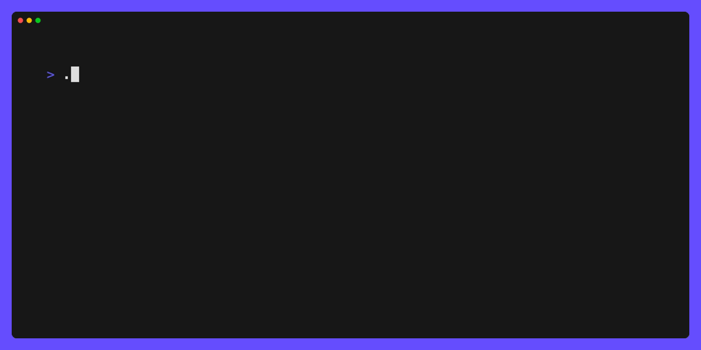

# answer

Have your user answer some questions in terminal.

This project intends to provide functionality similar to [github.com/AlecAivazis/survey](https://github.com/AlecAivazis/survey), but built on top of [bubbletea](https://github.com/charmbracelet/bubbletea).


[](./LICENSE)  
[](https://github.com/jimschubert/answer/actions/workflows/build.yml)
[](https://goreportcard.com/report/github.com/jimschubert/answer)

## Bubbles

This library provides the following bubbles:

* `input`: single-line textual input with validations
* `selection`: multi-selection with optional single-select

### input

The `input` bubble provides a minimal wrapper around `github.com/charmbracelet/bubbles/textinput`. You get all the implementation
of the upstream textinput bubble, with a little extra "flair" (a prompt prefix character, plus validations). This allows for styling
more closely to what you might have had with [github.com/AlecAivazis/survey](https://github.com/AlecAivazis/survey).

```go
package main

import (
	"errors"
	"fmt"
	"log"
	"os"
	"unicode"

	tea "github.com/charmbracelet/bubbletea"
	"github.com/jimschubert/answer/input"
)

func main() {
	m := input.New()
	m.Prompt = "Please enter your name:"
	m.Placeholder = "(first name only)"
	m.Validate = func(v string) error {
		if v == "" {
			return nil
		}
		if len(v) >= 2 && !unicode.IsUpper(rune(v[0])) {
			return errors.New("Name must be uppercase")
		}
		return nil
	}
	p := tea.NewProgram(&m)
	if _, err := p.Run(); err != nil {
		log.Fatal(err)
	}

	_, _ = fmt.Fprintf(os.Stdout, "Hi, %s!\n", m.Value())
}
```


### selection

The `selection` bubble provides a paginated list of items from which the user can select 0 or more items. This bubble defaults
to multi-select, but can be made single-select by setting `MaxSelections` to 1. Styles, as well as indicators for prompt,
chooser, and selection are customizable.

```go
package main

import (
	"fmt"
	"log"
	"os"

	tea "github.com/charmbracelet/bubbletea"
	"github.com/charmbracelet/lipgloss"
	"github.com/jimschubert/answer/colors"
	"github.com/jimschubert/answer/selection"
)

func main() {
	m := selection.New()
	m.Prompt = "Please select your three favorite letters:"
	m.MaxSelections = 3
	m.PerPage = 6
	m.ChooserIndicator = '✎'
	m.Styles.Text = lipgloss.NewStyle().Foreground(lipgloss.AdaptiveColor{Light: colors.TextLight, Dark: colors.TextDark})
	choices := make([]string, 0)
	for i := 'A'; i <= 'Z'; i++ {
		choices = append(choices, string(i))
	}
	m.Choices = choices
	p := tea.NewProgram(&m)
	if _, err := p.Run(); err != nil {
		log.Fatal(err)
	}

	_, _ = fmt.Fprintf(os.Stdout, "You selected: %v\n", m.SelectedValues())
}
```



## Install

```
go get -u github.com/jimschubert/answer
```

## Build/Test

```shell
go test -v -race -cover ./...
```

## License

This project is [licensed](./LICENSE) under Apache 2.0.
